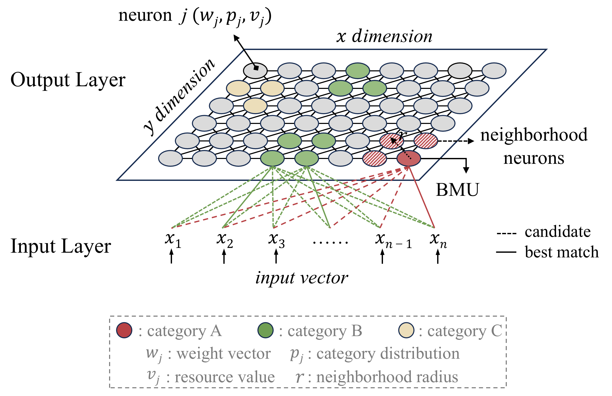
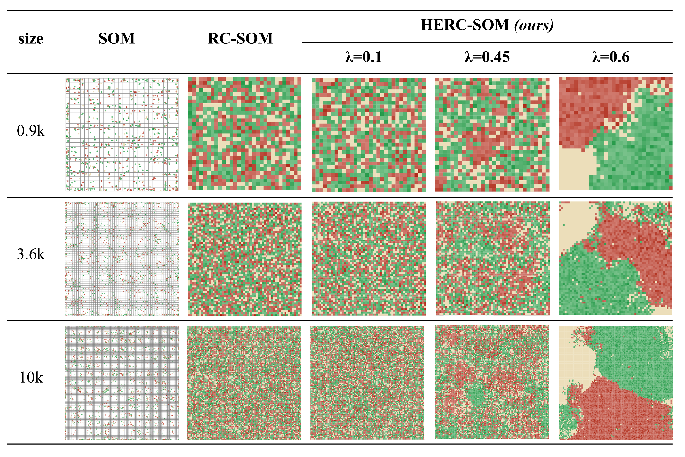

# HERC-SOM layout
Topology-optimized layout algorithm based on self-organizing maps.

# Introduction
<!-- HERC-SOM是一种基于SOM（自组织映射）与RC-SOM的布局优化算法。该算法旨在同时保持实例间的近似关系以及特定的分类结构。
输入：HERC-SOM接受大规模高维向量作为输入。
输出：它能够生成反映数据内在拓扑结构的布局结果。
-->
HERC-SOM is a layout optimization algorithm based on Self-Organizing Maps (SOM)[^fn1] and Resource-controlled self-organizing map (RC-SOM)[^fn2]. The algorithm aims to simultaneously preserve the approximate relationships among large-scale instances and maintain specific classification structures.

- **Input**: HERC-SOM accepts large-scale high-dimensional vectors as input.
- **Output**: HERC-SOM outputs a 2D topological layout.


<center>
  
  <p>Figure 1: HERC-SOM schematic</p>
</center>

# HERC-SOM vs. SOM and RC-SOM
<!-- HERC-SOM 优化了匹配簇的分布，有效缓解了 SOM 中出现的视觉遮挡和像素利用率低的限制，以及 RC-SOM 无法清晰划分簇的问题。-->
HERC-SOM optimizes the clusters distribution, effectively alleviating the limitations of visual occlusion and inefficient pixel utilization in SOM, as well as the inability of RC-SOM to clearly delineate clusters.

<center>
  
  <p>Figure 2: Algorithm Comparison</p>
</center>


# Getting Started with HERC-SOM

```python
import numpy as np
from minisomHERC import MiniSom

# Prepare your data
n = 10000 # samples
weight_dim = 100 # feature dimension
data = np.random.rand(n, weight_dim) # input data
k = 5 # categories
label_encoding = np.random.randint(0, k, size=n) # input label distributions

# Initialize the parameters
row = 100 # number of grid rows
column = 100 # number of grid rows
alpha = 0.6 # weight
sigma = 3.0 # initial neighborhood radius
learning_rate = 0.7 # learning rate 
iterations = 500 # iterations

# Initialize and train the model
hercsom = MiniSom(row, column, weight_dim, resource_limit=1,
                      data=data, labels_encoding=label_encoding, alpha=alpha,
                      sigma=sigma, learning_rate=learning_rate,
                      activation_distance='euclidean',
                      topology='rectangular', neighborhood_function='gaussian', random_seed=10)
hercsom.pca_weights_init(data)
hercsom.train(data, iterations, verbose=True)

```

If HERC-SOM was used in your research, please cite the following reference:
```bibtex
@misc{herc-som,
  author       = {Tong Li, Guodao Sun, Xueqian Zheng, Haixia Wang and Ronghua Liang},
  title        = {CompoVis: Is Cross-modal Semantic Alignment of CLIP Optimal? A Visual Analysis Attempt},
  year         = {2025},
  publisher    = {GitHub},
  journal     = {GitHub repository},
  howpublished = {\url{https://github.com/TongLi97/HERCSOM-layout}},
}
```

# References

[^fn1]: Kohonen Teuvo and Honkela Timo. (2007). "Kohonen network". *Scholarpedia*, 2(1), 1568.

[^fn2]: Tu Yamei, Qiu Rui, Wang Yu-Shuen, Yen Po-Yin and Shen Han-Wei. (2022). "PhraseMap: Attention-based keyphrases recommendation for information seeking". *IEEE Transactions on Visualization and Computer Graphics*, 30(3), 1787-1802.
